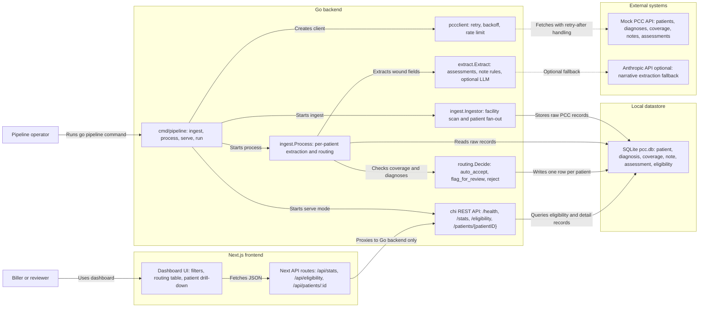
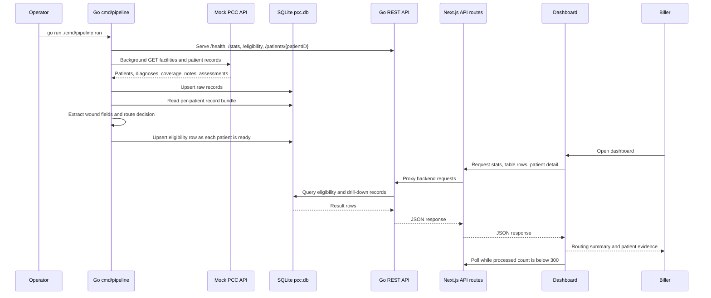

# End-to-End Architecture

This project ingests synthetic PCC patient data, extracts wound-care billing fields, routes each patient to a biller-facing decision, and displays the result in a Next.js dashboard.

## Runtime Flow

## Key Data Products

- Raw PCC tables: `patient`, `diagnosis`, `coverage`, `note`, `assessment`
- Derived output table: `eligibility`
- Dashboard-facing API:
  - `GET /stats`
  - `GET /eligibility`
  - `GET /patients/{patientID}`

## Operational Modes

- `go run ./cmd/pipeline ingest`: fetch raw PCC data, then process it
- `go run ./cmd/pipeline process`: re-run extraction and routing on existing SQLite data
- `go run ./cmd/pipeline serve`: serve the REST API from existing SQLite data
- `go run ./cmd/pipeline run`: ingest, process, then serve
